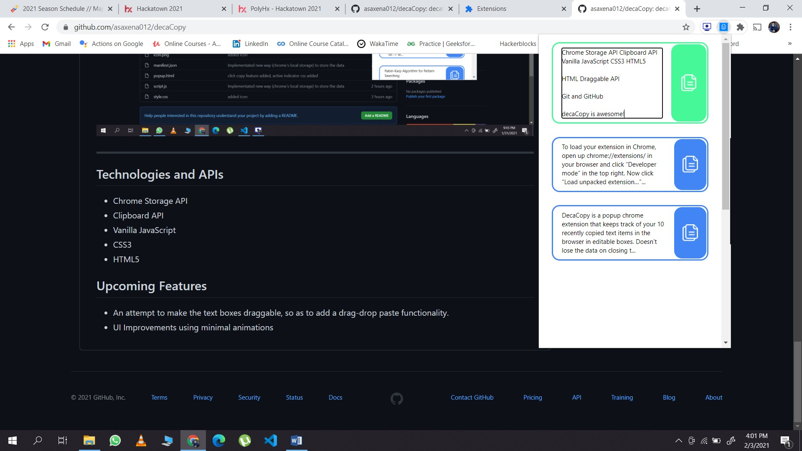

# DecaCopy

DecaCopy is a popup chrome extension that keeps track of your 10 recently copied text items in the browser in editable boxes. Doesn't lose the data on closing the tab/browser.

## Installation (How to run locally?)

Download the zip file of the code, then follow the following instructions:

> To load your extension in Chrome, open up chrome://extensions/ in your browser and click “Developer mode” in the top right. Now click “Load unpacked extension…” and select the extension’s directory. You should now see your extension in the list.

---
### Watch the working demo [here](https://www.youtube.com/watch?v=2ABCHB2TIlg) | Images 

---

## Technologies and APIs 
- Chrome Storage API
- Clipboard API
- Vanilla JavaScript
- CSS3
- HTML5

## Upcoming Features

- An attempt to make the text boxes draggable, so as to add a drag-drop paste functionality.
- UI Improvements using minimal animations
